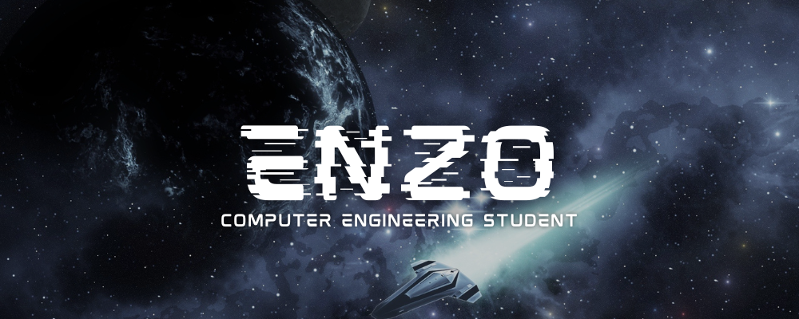

<h1 align="center">Hi 👋, I'm Enzo Lopes</h1>
<h3 align="center">A young programmer from Brazil</h3>

 I boost business with technological solutions 💻

 
  

  
  
  
  

 

  
  
  
  

  

- 🌱 I am currently learning **Desenvolvimento Web**

- 👨‍💻 All my projects are available on [GitHub](https://github.com/enzodevs)

- 💬 Ask me about **Java, Python, e Web development**

- 📫 How to reach me: **enzolopes@gmail.com**

 
<h3 align="left">Connect with me:</h3>

 

<h3 align="left">Languages ​​and Tools:</h3>

- Backend

  

- Frontend

  

- Tools

  

 

<h3 align="left">GitHub Stats:</h3>

 

  

<h3 align="left">Activity:</h3>

  

 <em><b>Come talk to me if you want to talk about technologies, creating software products or chess ♟️</b> :)</em>

 
